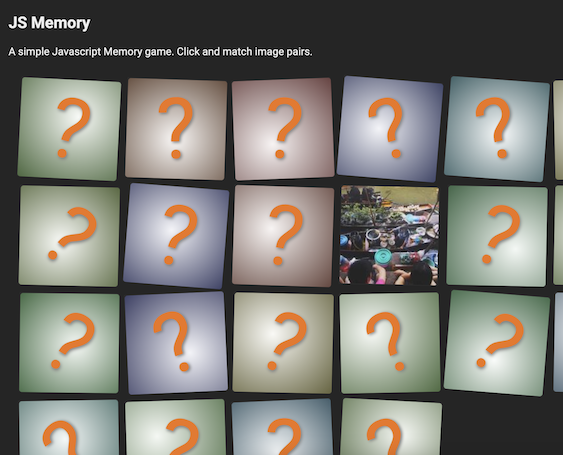

## js-memory
A simple Javascript based Memory-game.

This uses D3.js and Lodash, along with:
- https://github.com/mwdchang/image-util/ (image loading/util)
- https://github.com/crashmax-dev/fireworks-js/ (fireworks animation)
- https://picsum.photos/ (source images)

 
### Old version
This was originally written to work with Picasa and had a server component, by scanning a person's public albums and use the underlying content as image sources. However this no longer worked since Google discontinued Picasa around 2017 or so. 

For kicks and giggles see `archive` for the old version.

